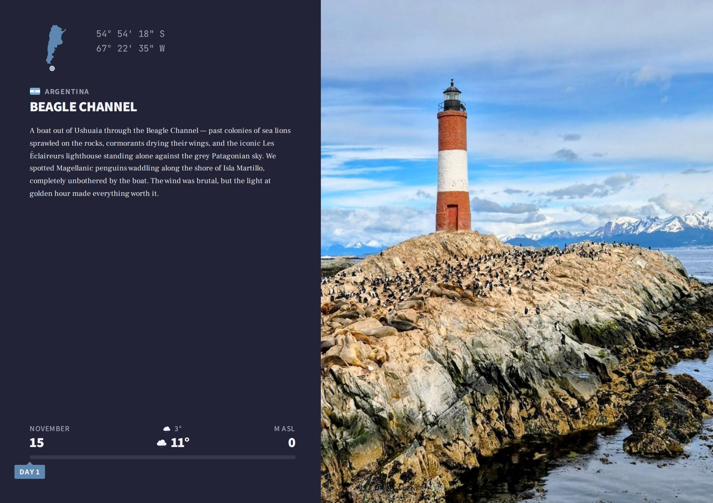

<p align="center">
  
</p>

<h1 align="center">Wanderbound</h1>

<p align="center">
  Turn a <a href="https://www.polarsteps.com/">Polarsteps</a> data export into a print-ready photo album.
</p>

<p align="center">
  
</p>

Upload your Polarsteps ZIP and get a laid-out album - covers, overview page,
maps, photo pages - that you can edit in the browser and export to PDF.

- Photo layout algorithm packs images into grids, with drag-and-drop reordering
- GPS tracks classified into flights, hikes, drives, and walks - add map pages
  with satellite imagery and elevation profiles
- Videos in albums - scrub frame-by-frame to pick a poster image
- Full RTL and localization support (English and Hebrew)
- PDF export via headless Chromium

## Tech Stack

|                   |                                                                      |
|-------------------|----------------------------------------------------------------------|
| **Backend**       | Python 3.14, FastAPI, SQLAlchemy, Polars, Playwright, Pillow, ffmpeg |
| **Frontend**      | Vue 3, TypeScript, Quasar, Mapbox GL JS                              |
| **Database**      | PostgreSQL 18                                                        |
| **External APIs** | Open-Meteo (elevations + weather), Mapbox (tiles + routing)          |

## Self-Hosting

Requires [Docker](https://docs.docker.com/get-docker/) with Compose.

```bash
git clone https://github.com/itay-raveh/wanderbound.git
cd wanderbound

cp .env.example .env
# Fill in the required values

docker compose up -d
```

Open `http://localhost:5173`.

For production, set `DOMAIN` and `ENVIRONMENT=production` in `.env` and run
`docker compose -f compose.yml up -d`.

## Development

[mise](https://mise.jdx.dev/) manages tool versions (Python 3.14, Bun) and
all project commands. Install it, then:

```bash
mise install            # Install Python + Bun
cd backend && uv sync   # Install backend deps
cd frontend && bun install  # Install frontend deps
```

Start Postgres, run migrations, then the dev servers:

```bash
docker compose up db -d      # Start Postgres
mise run migrate             # Run database migrations
mise run dev:backend         # FastAPI dev server
mise run dev:frontend        # Vite dev server
```

Run `mise tasks` to see all available commands. Extra arguments pass
through - e.g., `mise run test:backend -k test_auth`.

## Scaling Notes

**Single-worker requirement** - The backend uses in-memory state for processing
sessions, PDF render concurrency, and activity debouncing. Running multiple
uvicorn workers or multiple backend containers would break these. To scale
horizontally, move session/semaphore state to Redis first.

**Structured logging** - The backend currently uses Python stdlib logging.
For log aggregation (CloudWatch, Loki, Datadog), switch to JSON-structured
logging (e.g., `python-json-logger`) and add a correlation ID middleware.

## License

MIT
