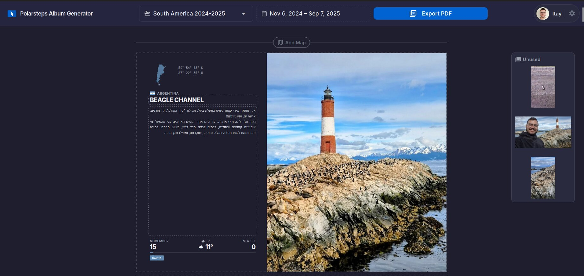
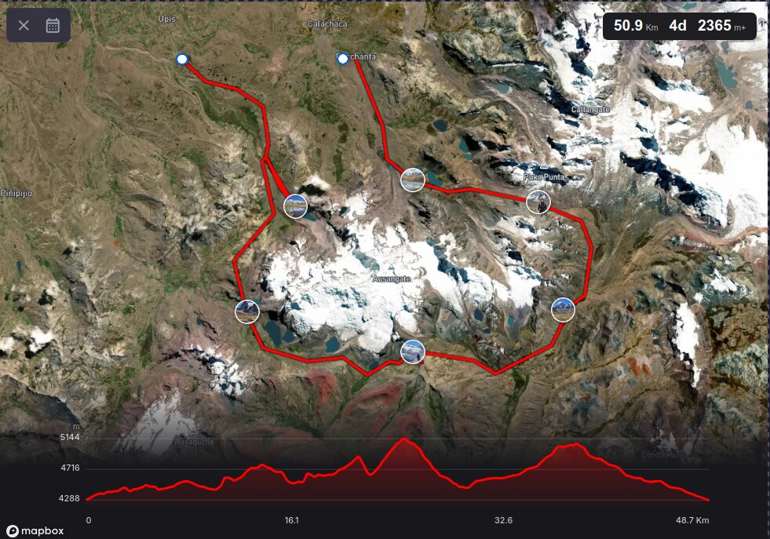

<p align="center">
  
</p>

<h1 align="center">Polarsteps Album Generator</h1>

<p align="center">
  Converts a <a href="https://www.polarsteps.com/">Polarsteps</a> data export into a print-ready photo album.
</p>

<p align="center">
  
</p>

Upload your Polarsteps ZIP and get a laid-out album - covers, overview page, maps, photo pages - that you can edit and export to PDF.

- GPS tracks classified into flights, hikes, driving, walking. Hikes get a dedicated page with satellite map and elevation profile
- Photo layout algorithm packs images into grids by orientation
- Videos in albums - scrub frame-by-frame to pick a poster
- Drag-and-drop editor with dark/light mode
- English and Hebrew with RTL support
- PDF export via headless Chromium

<p align="center">
  
</p>

## Tech Stack

| | |
|---|---|
| **Backend** | Python 3.14, FastAPI, SQLAlchemy 2, Polars, Playwright, Pillow, ffmpeg |
| **Frontend** | Vue 3, TypeScript, Quasar, Mapbox GL JS |
| **Database** | PostgreSQL 18 |
| **External APIs** | Open-Meteo (elevations + weather), Mapbox (tiles + routing) |

## Self-Hosting

Requires [Docker](https://docs.docker.com/get-docker/) with Compose.

```bash
git clone https://github.com/itayraveh/polarsteps-album-generator.git
cd polarsteps-album-generator
cp .env.example .env
# Fill in required variables (see below)
docker compose up -d
```

Open `http://localhost:5173`.

| Variable | Required | Notes |
|---|---|---|
| `SECRET_KEY` | Yes | `python -c "import secrets; print(secrets.token_urlsafe(32))"` |
| `VITE_GOOGLE_CLIENT_ID` | Yes | [Google Cloud Console](https://console.cloud.google.com/apis/credentials) -> OAuth 2.0 Client ID |
| `VITE_MAPBOX_TOKEN` | Yes | Free tier at [mapbox.com](https://www.mapbox.com/) |
| `POSTGRES_PASSWORD` | Yes | Any value |

For production, set `DOMAIN` in `.env` and run `docker compose -f compose.yml up -d`.

## Development

Python 3.14+ with [uv](https://docs.astral.sh/uv/), [Bun](https://bun.sh/), Docker (for Postgres).

```bash
cd backend && uv sync
cd ../frontend && bun install
docker compose up db -d
cd ../backend && uv run alembic upgrade head
uv run uvicorn app.main:app --reload --log-config logging.json
# Separate terminal:
cd frontend && bun run dev
```

```bash
uv run pytest              # Backend tests
bun run build              # Frontend type-check + build
```

## License

MIT
