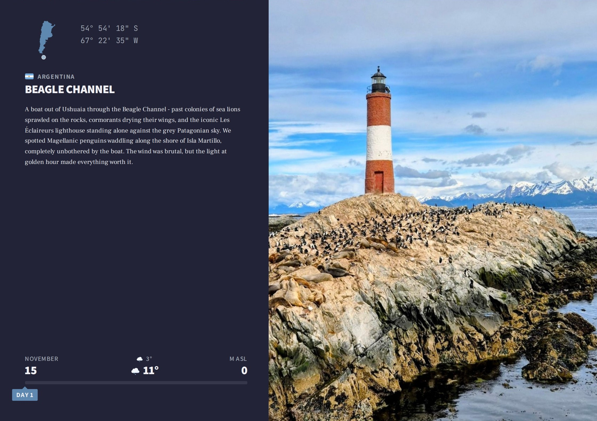
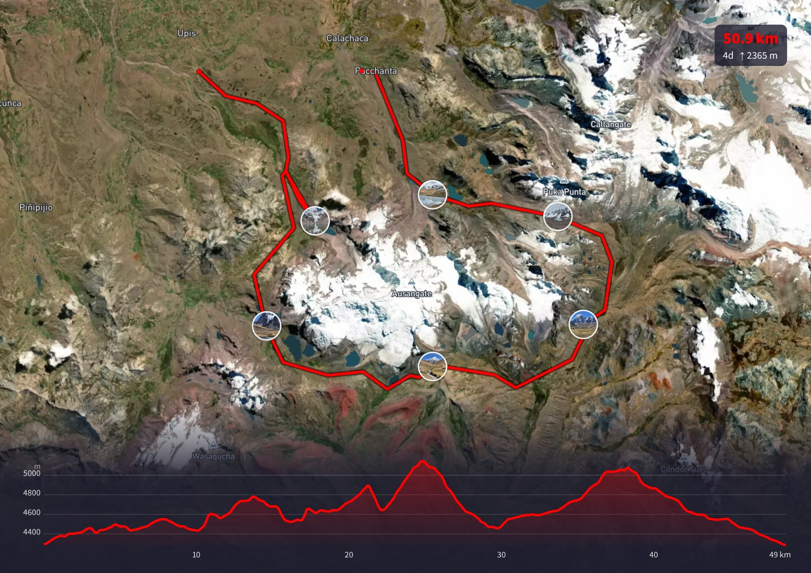
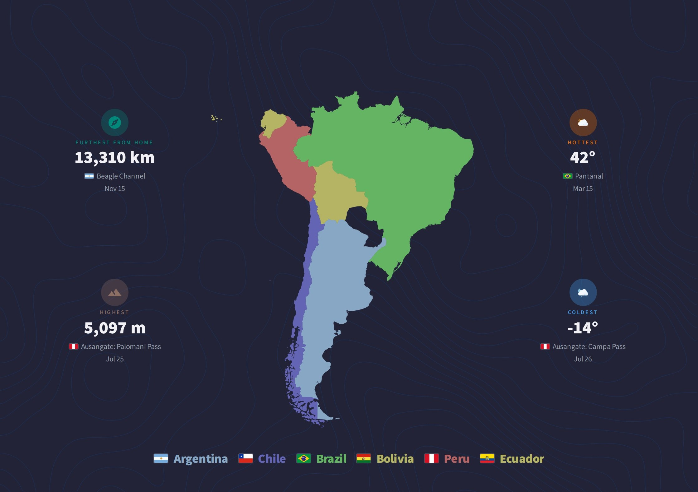
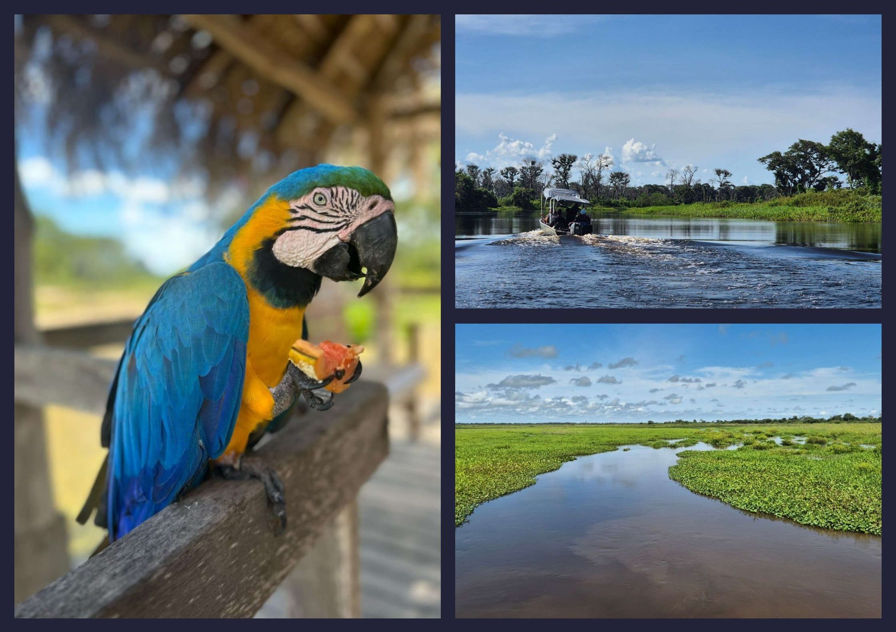

<p align="center">
  
</p>

<h1 align="center">Wanderbound</h1>

<p align="center"><a href="https://wanderbound.raveh.dev">https://wanderbound.raveh.dev</a></p>

<p align="center">
  Turn a <a href="https://www.polarsteps.com/">Polarsteps</a> data export into an amazing album, exported as a PDF you can print yourself!
</p>

<p align="center">
  <a href="https://github.com/itay-raveh/wanderbound/actions/workflows/ci.yml"></a>
  <a href="https://github.com/itay-raveh/wanderbound/releases"></a>
  <a href="https://github.com/itay-raveh/wanderbound/blob/main/LICENSE"></a>
</p>

<p align="center">
  
</p>

- Start from an intelligently laid out album, then edit with full freedom
- Backfills enhanced weather and elevation data, and automaticly recognizes known mountion peaks
- Upgrades compressed Polarsteps photos with originals from Google Photos
- Add maps with your GPS data. Automaticaly recognizes hikes, flights, and roads
- Include your videos in the album by selecting one frame, right within our editor
- Full RTL and localization support

See planned features, or ask for your own, [here](https://github.com/itay-raveh/wanderbound/issues?q=is%3Aissue%20state%3Aopen%20label%3Aenhancement).

<p align="center">
  &nbsp;
  &nbsp;
  
</p>

## Tech Stack

|                    |                                                                     |
|--------------------|---------------------------------------------------------------------|
| **Backend**        | FastAPI, SQLAlchemy, Polars, Playwright, DBOS, PyAv, ffmpeg         |
| **Frontend**       | Vue, Quasar, Uppy, Mapbox, Turf                                     |
| **Storage**        | PostgreSQL, S3                                                      |
| **External APIs**  | Open-Meteo, Mapbox, Google Photos Picker, OpenStreetMap Overpass    |

## Self-Hosting

You can see [the setup for the public instance](https://github.com/itay-raveh/infra) for insparation.

### Kubernetes

We provide a Helm chart, see the [installation guide](charts/wanderbound/README.md).

### Docker Compose

[mise](https://mise.jdx.dev/) manages tool versions and all project
commands. Install it, then:

```bash
git clone https://github.com/itay-raveh/wanderbound.git
cd wanderbound

mise run setup
```

Fill in the values in the created `.env` file.

Run at <https://localhost:8000>:

```bash
docker compose up -d
```

This will spin up Wanderbound, PostgresSQL (DB), and Garage (S3).

For production, set `ENVIRONMENT=production`, `APP_VERSION` to one of our [tags](https://github.com/itay-raveh/wanderbound/tags),
and `DOMAIN`, then use:

```bash
docker compose -f compose.yml up -d
```

## Development

Clone, run `mise run setup` and fill in `.env`, as described above.

To see other project commands:

```bash
mise tasks
```

To run the local dev stack at <https://localhost:5173>:

```bash
mise run dev
```
